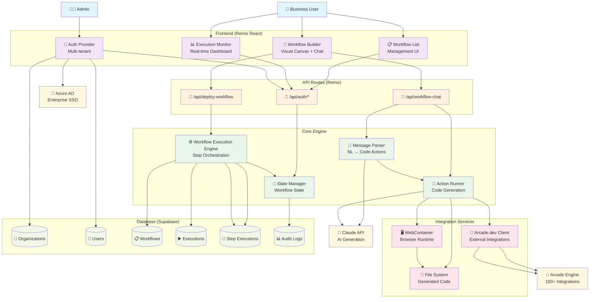
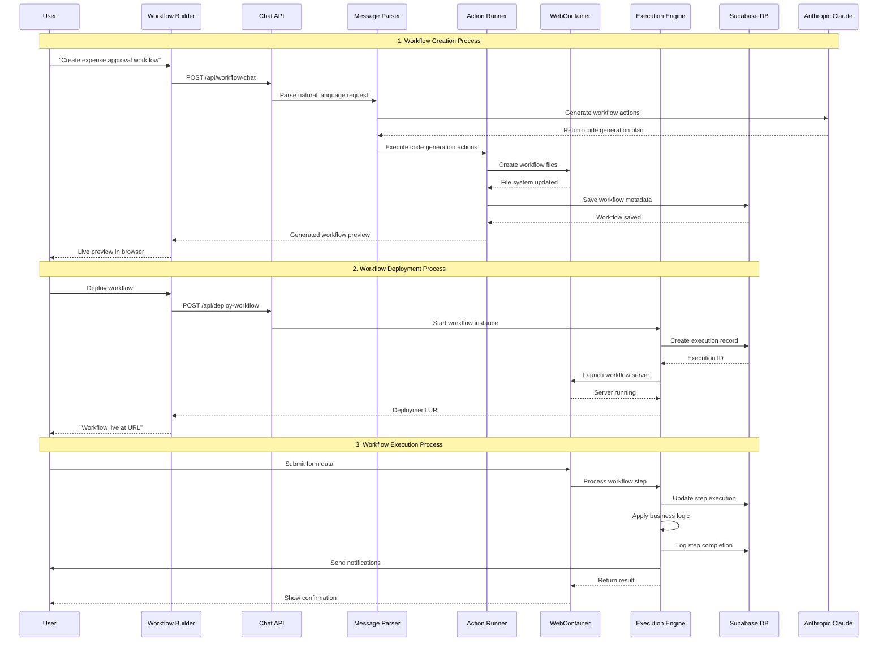
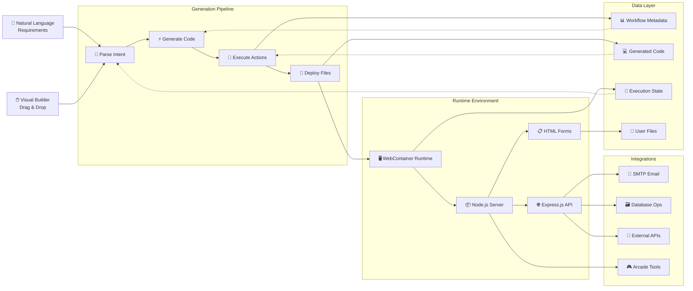
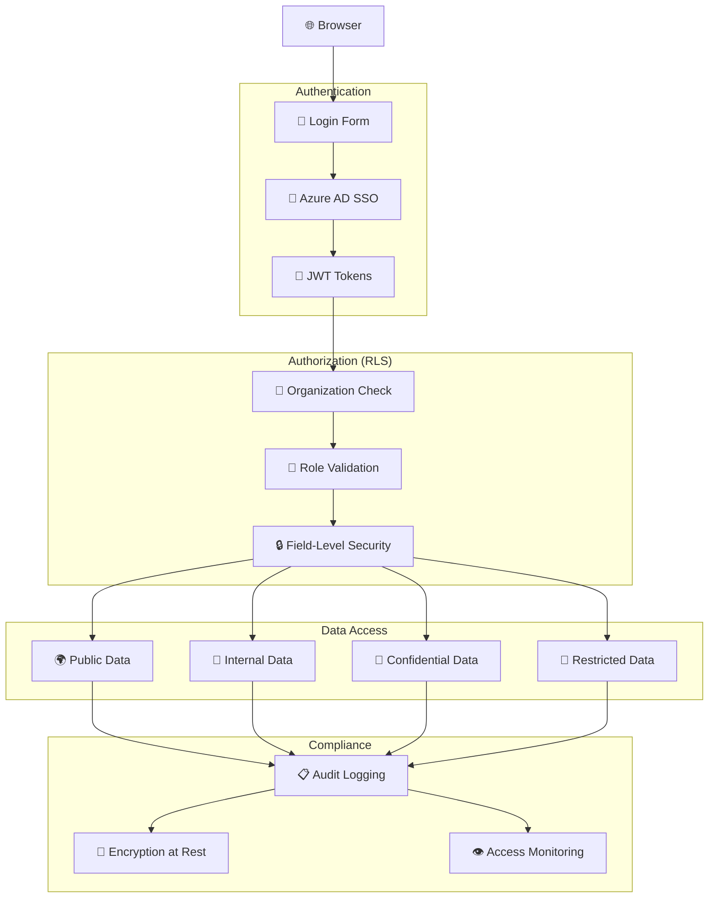
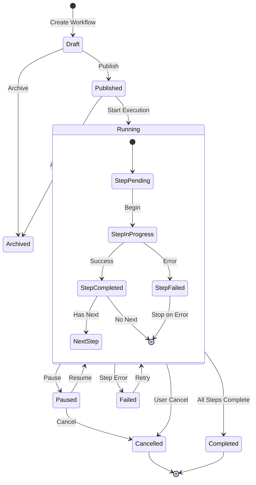
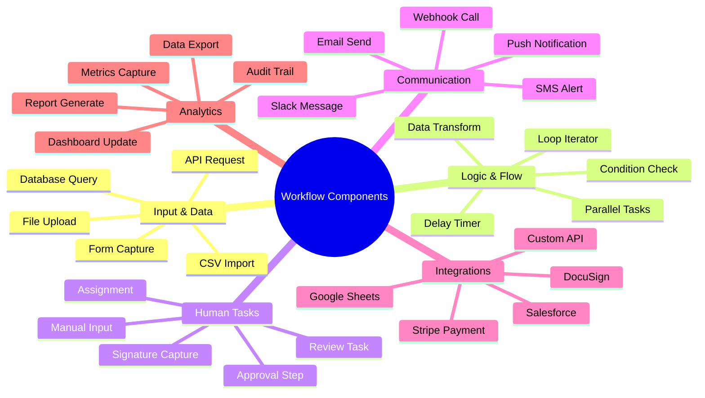

# WorkflowHub Architecture Diagram

## System Overview



## Detailed Component Interaction Flow



## Data Flow Architecture



## Security & Authentication Flow



## Workflow Execution State Machine



## Component Library Structure



## Technology Stack Integration

```mermaid
graph TB
    %% Presentation Layer
    subgraph "Frontend Stack"
        Remix[⚛️ Remix Framework]
        React[⚛️ React Components]
        ReactFlow[🌊 React Flow Canvas]
        UnoCSS[🎨 UnoCSS Styling]
    end
    
    %% API Layer
    subgraph "API & Routing"
        RemixAPI[🛤️ Remix API Routes]
        CloudflareWorkers[☁️ Cloudflare Workers]
        Pages[📄 Cloudflare Pages]
    end
    
    %% AI & Generation
    subgraph "AI Services"
        Claude[🤖 Anthropic Claude]
        AiSDK[@ai-sdk/anthropic]
        StreamText[📡 Streaming Responses]
    end
    
    %% Runtime
    subgraph "Code Execution"
        WebContainer[🖥️ WebContainer API]
        NodeJS[📦 Node.js Runtime]
        ExpressJS[🌐 Express.js Server]
    end
    
    %% Database & Auth
    subgraph "Backend Services"
        Supabase[🗄️ Supabase PostgreSQL]
        SupaAuth[🔐 Supabase Auth]
        RLS[🛡️ Row Level Security]
    end
    
    %% External Integrations
    subgraph "External APIs"
        ArcadeEngine[🎮 Arcade.dev Engine]
        AzureAD[🔷 Azure Active Directory]
        SMTP[📧 Email Services]
    end
    
    %% Connections
    React --> ReactFlow
    React --> UnoCSS
    Remix --> React
    Remix --> RemixAPI
    
    RemixAPI --> CloudflareWorkers
    CloudflareWorkers --> Pages
    
    RemixAPI --> Claude
    Claude --> AiSDK
    AiSDK --> StreamText
    
    RemixAPI --> WebContainer
    WebContainer --> NodeJS
    NodeJS --> ExpressJS
    
    RemixAPI --> Supabase
    Supabase --> SupaAuth
    Supabase --> RLS
    
    RemixAPI --> ArcadeEngine
    SupaAuth --> AzureAD
    ExpressJS --> SMTP
```

This comprehensive architecture diagram shows how WorkflowHub's components interact across multiple layers, from user interface to data storage, including the AI-powered code generation pipeline and real-time execution environment.