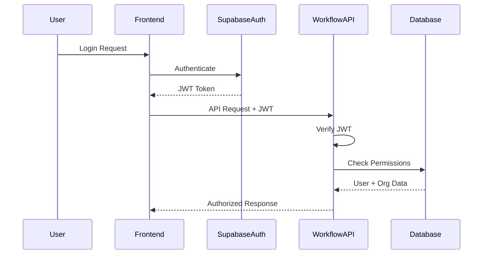

# WorkflowHub Authentication Architecture

## Overview

WorkflowHub requires enterprise-grade authentication supporting multi-tenancy, role-based access control (RBAC), and seamless integration with existing identity providers.

## Authentication Requirements

### From PRD:
- **Multi-tenant**: Support for multiple organizations
- **Role-based**: Builder, Business User, Approver, Admin
- **Enterprise Integration**: AD/Azure AD sync
- **API Access**: Secure API key management
- **Audit Trail**: Complete authentication logging

## Proposed Architecture

### 1. Authentication Provider: Supabase Auth

**Why Supabase?**
- Built-in multi-tenancy support
- Row Level Security (RLS) for data isolation
- OAuth2/SAML integration
- JWT-based authentication
- Real-time capabilities for workflow notifications

### 2. User & Tenant Model

```typescript
// Database Schema
interface Organization {
  id: string
  name: string
  plan: 'starter' | 'professional' | 'enterprise'
  settings: {
    ssoEnabled: boolean
    ssoProvider?: 'azure' | 'okta' | 'google'
    allowedDomains: string[]
  }
  createdAt: Date
  updatedAt: Date
}

interface User {
  id: string
  email: string
  organizationId: string
  role: 'admin' | 'builder' | 'user' | 'approver'
  profile: {
    name: string
    avatar?: string
  }
  permissions: Permission[]
  lastLogin: Date
  createdAt: Date
}

interface Permission {
  resource: 'workflow' | 'integration' | 'user' | 'settings'
  actions: ('create' | 'read' | 'update' | 'delete' | 'execute')[]
}
```

### 3. Authentication Flow



### 4. Role Definitions

| Role | Capabilities | License Type |
|------|-------------|--------------|
| **Admin** | • Manage users & permissions<br>• Configure integrations<br>• View all workflows<br>• Access audit logs | Included with Builder |
| **Builder** | • Create/edit workflows<br>• Test workflows<br>• Publish workflows<br>• View execution logs | £2k/month |
| **User** | • Execute assigned workflows<br>• View own tasks<br>• Submit data<br>• Track status | £10/month |
| **Approver** | • Approve/reject tasks<br>• Add comments<br>• Delegate approvals<br>• View approval history | £10/month |

### 5. API Key Management

```typescript
interface ApiKey {
  id: string
  organizationId: string
  name: string
  keyHash: string // bcrypt hash
  permissions: Permission[]
  lastUsed?: Date
  expiresAt?: Date
  createdBy: string
  createdAt: Date
}

// API Key Authentication Middleware
async function authenticateApiKey(req: Request): Promise<AuthContext> {
  const apiKey = req.headers['x-api-key']
  if (!apiKey) throw new UnauthorizedError()
  
  const keyData = await validateApiKey(apiKey)
  return {
    type: 'api',
    organizationId: keyData.organizationId,
    permissions: keyData.permissions
  }
}
```

### 6. Implementation Plan

#### Phase 1: Basic Auth (Week 1)
- [ ] Set up Supabase project
- [ ] Create user/organization tables
- [ ] Implement signup/login flows
- [ ] Add JWT verification middleware

#### Phase 2: RBAC (Week 2)
- [ ] Implement role-based permissions
- [ ] Create permission checking utilities
- [ ] Add Row Level Security policies
- [ ] Build user management UI

#### Phase 3: Enterprise Features (Week 3)
- [ ] Add SSO integration (Azure AD)
- [ ] Implement API key management
- [ ] Create audit logging system
- [ ] Add session management

### 7. Security Measures

1. **Password Policy**
   - Minimum 12 characters
   - Complexity requirements
   - Password history (no reuse)

2. **Session Management**
   - 30-day refresh tokens
   - 1-hour access tokens
   - Device fingerprinting
   - Concurrent session limits

3. **API Security**
   - Rate limiting (100 req/min)
   - API key rotation
   - IP allowlisting (Enterprise)
   - Request signing

4. **Audit Logging**
   ```typescript
   interface AuditLog {
     id: string
     organizationId: string
     userId?: string
     apiKeyId?: string
     action: string
     resource: string
     resourceId: string
     ipAddress: string
     userAgent: string
     timestamp: Date
     metadata?: Record<string, any>
   }
   ```

### 8. Migration from Current Codebase

**Current State**: No authentication
**Migration Steps**:
1. Wrap existing routes with auth middleware
2. Add organization context to all data models
3. Implement tenant isolation in queries
4. Update UI to show user context

### 9. Integration with Arcade.dev

```typescript
// Arcade Authorization Wrapper
class ArcadeAuthManager {
  async authorizeUser(userId: string, tool: string) {
    const user = await getUser(userId)
    const org = await getOrganization(user.organizationId)
    
    // Check if org has tool access
    if (!org.enabledTools.includes(tool)) {
      throw new ForbiddenError('Tool not enabled for organization')
    }
    
    // Get or create Arcade authorization
    return await arcade.authorizeToolAsync({
      userId: `${org.id}:${user.id}`,
      toolName: tool
    })
  }
}
```

## Next Steps

1. **Decision Required**: Confirm Supabase vs alternatives (Auth0, Clerk)
2. **Setup**: Initialize authentication infrastructure
3. **Implementation**: Start with basic auth, iterate to enterprise features
4. **Testing**: Security audit before launch

---

*Status: Ready for Implementation*
*Dependencies: Database setup, Frontend framework decision*