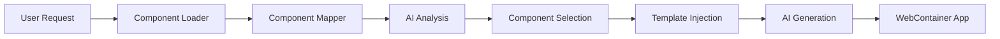

# Component Library Integration Guide

## Overview

The WorkflowHub component library system is now fully integrated with the WebContainer workflow generation. This means that when users create workflows through natural language, the system automatically:

1. Analyzes the user's request for relevant components
2. Loads matching components from the organization's library
3. Provides component templates to the AI for use in generated code
4. Tracks component usage for analytics

## Architecture

### Key Components

1. **ComponentLoader** (`/app/lib/workflow/generators/component-loader.ts`)
   - Loads components from Supabase based on organizationId
   - Uses AI keywords to match components to user requirements
   - Provides usage analytics

2. **ComponentMapper** (`/app/lib/ai/component-mapper.ts`)
   - AI-powered component suggestion engine
   - Analyzes workflow descriptions for relevant components
   - Returns confidence-scored matches

3. **ComponentTemplateProcessor** (`/app/lib/workflow/generators/component-template-processor.ts`)
   - Processes component HTML templates
   - Replaces placeholders with actual field values
   - Handles validation and styling

4. **API Integration** (`/app/routes/api.workflow-chat-v2.ts`)
   - Enhanced to load components before AI generation
   - Includes component templates in AI prompts
   - Logs component usage for analytics

## How It Works

### 1. User Request Flow



### 2. Component Loading Process

When a user requests a workflow:

```javascript
// In api.workflow-chat-v2.ts
const componentLoader = new ComponentLoader(organizationId);
const loadedComponents = await componentLoader.loadComponentsForWorkflow(userRequest);
```

This:
- Queries Supabase for active components
- Analyzes the request for keywords
- Returns confidence-scored matches

### 3. AI Prompt Enhancement

The loaded components are injected into the AI prompt:

```
🎨 AVAILABLE COMPONENTS FROM ORGANIZATION'S LIBRARY:
- Employee Name Field: Captures employee full name (confidence: 10)
- Business Email Input: Validated business email field (confidence: 8)
- Currency Amount Input: Financial amount with formatting (confidence: 7)

📋 COMPONENT TEMPLATES TO USE:
<!-- Component: Employee Name Field -->
<div class="form-group">
  <label for="{{name}}">{{label}}<span class="required">*</span></label>
  <input type="text" name="{{name}}" required />
</div>
```

### 4. Generated Code Uses Components

The AI then generates Node.js applications that use these exact templates:

```html
<!-- Generated by AI using component library -->
<div class="form-group">
  <label for="employee_name">Employee Name<span class="required">*</span></label>
  <input type="text" name="employee_name" required />
</div>
```

## Example Usage

### 1. Expense Approval Workflow

**User Request**: "Create an expense approval workflow"

**Component Matches**:
- Employee Name Field (confidence: 10)
- Currency Amount Input (confidence: 9)
- Receipt Upload (confidence: 9)
- Manager Approval Buttons (confidence: 8)

**Generated Form** (uses actual component templates):
```html
<form id="expense-form">
  <!-- Employee Name Field Component -->
  <div class="form-group">
    <label for="employee_name">Employee Name<span class="required">*</span></label>
    <input type="text" name="employee_name" required class="form-control" />
  </div>
  
  <!-- Currency Amount Input Component -->
  <div class="form-group">
    <label for="amount">Expense Amount<span class="required">*</span></label>
    <input type="number" name="amount" required min="0" step="0.01" class="form-control" />
  </div>
  
  <!-- Receipt Upload Component -->
  <div class="form-group">
    <label for="receipt">Receipt Upload<span class="required">*</span></label>
    <input type="file" name="receipt" required accept="image/*,application/pdf" />
  </div>
</form>
```

## Benefits

1. **Consistency**: All workflows use standardized, tested components
2. **Quality**: Pre-built components have proper validation and styling
3. **Speed**: AI doesn't need to create components from scratch
4. **Analytics**: Track which components are used most
5. **Maintenance**: Update components in one place, affect all workflows

## Testing

### Test Endpoint

Use the test endpoint to verify component library integration:

```bash
curl -X POST http://localhost:3000/api/test-component-library \
  -H "Content-Type: application/json" \
  -d '{
    "organizationId": "your-org-id",
    "workflowDescription": "expense approval workflow"
  }'
```

### Expected Response

```json
{
  "success": true,
  "test": "Component Library Integration Test",
  "results": {
    "componentsLoaded": {
      "total": 15,
      "byStep": {
        "capture": 8,
        "review": 3,
        "approval": 2,
        "update": 2
      }
    },
    "formGeneration": {
      "fieldsProvided": 5,
      "componentsUsed": 5,
      "components": [
        "Employee Name Field (short-text-box)",
        "Business Email Input (email-input)",
        "Currency Amount Input (number-input)",
        "Receipt Upload (file-upload)",
        "Long Description Box (long-text-box)"
      ]
    }
  }
}
```

## Component Usage Analytics

The system automatically logs:
- Which components are suggested for each workflow
- Confidence scores for matches
- Timestamp of usage
- Organization context

This data is stored in the `component_usage_logs` table for analysis.

## Future Enhancements

1. **Real-time Template Injection**: Modify the AI stream to inject templates in real-time
2. **Component Versioning**: Track which version of components are used
3. **A/B Testing**: Test different component variations
4. **Custom Styling**: Allow organizations to customize component CSS
5. **Component Marketplace**: Share components between organizations

## Troubleshooting

### Components Not Loading

1. Check organizationId is passed correctly
2. Verify components exist in database
3. Check component `active` status
4. Verify `compatible_steps` includes the workflow step

### Templates Not Being Used

1. Ensure component has `html_template` field populated
2. Check AI prompt includes component templates
3. Verify placeholder syntax ({{name}}, {{label}})

### Analytics Not Recording

1. Check `component_usage_logs` table exists
2. Verify RLS policies allow inserts
3. Check Supabase connection is active